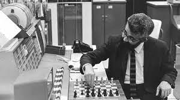
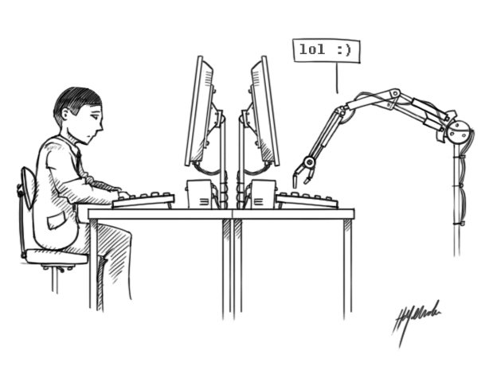
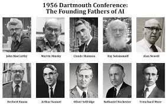
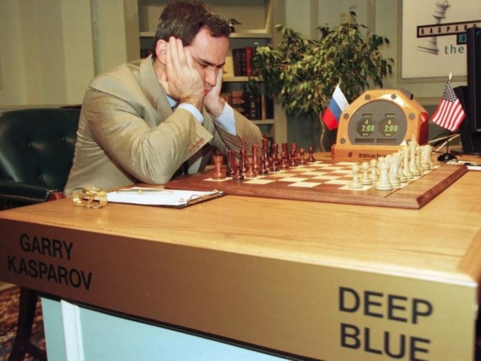
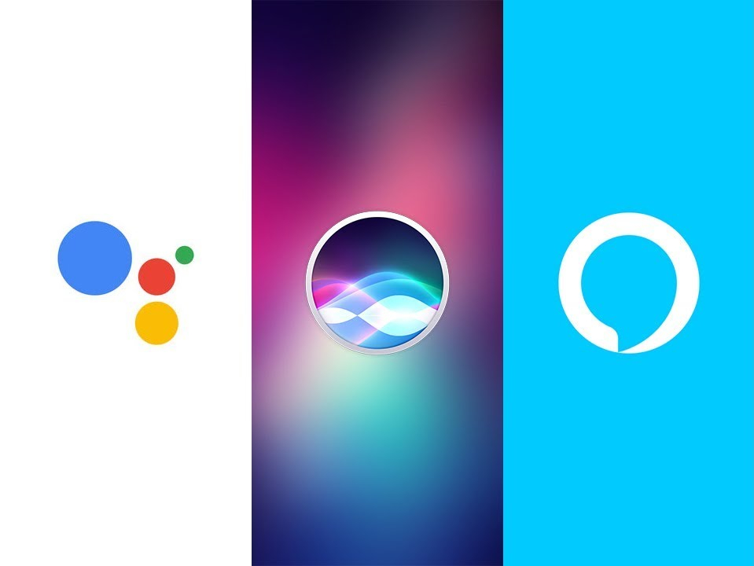
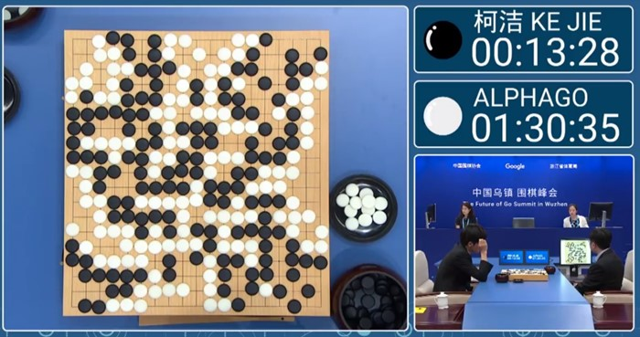

# Conceitos a serem discutidos

## O que é inteligência artificial

Inteligência artificial refere-se a sistemas ou máquinas que imitam a inteligência humana para realizar tarefas e podem se aprimorar iterativamente com base nas informações que coletam. (Oracle)

O termo "inteligência artificial" foi utilizado pela primeira vez em 1985, pelo professor de matemática Jonh McCarthy, que no ano seguinte organizou uma conferência sobre o assunto, o Dartmouth Summer Research Project on Artificial Intelligence, um brainstorm de quase oito semanas.

Os especialistas acreditavam na construção de computadores para desempenhar tarefas ligadas à cognição, incluindo abstração e uso de linguagem. "Todos os aspectos da aprendizagem, ou qualquer outra característica da inteligência, podem, em princípio, ser descritos tão precisamente que uma máquina será capaz de simulá-los".

## Histórico de inteligência artificial

As ideias relacionadas com inteligência artificial são de bem antes do surgimento da computação. O ser humano sempre quis uma "máquina" que fizesse o trabalho de agir e pensar.

Em 1946, Warren McCulloch e Walter Pitts apresentaram um artigo que fala pela primeira vez de redes neurais, estruturas de raciocínio artificiais em forma de modelo matemático que imitam o sistema nervoso do ser humano.

No ano de 1950, Alan Turing desenvolveu o jogo da imitação, uma forma de avaliar se uma máquina consegue se passar por um ser humano em uma conversa por escrito.

No ano de 1951, Marvin Minsky criou o SNARC, uma calculadora de operações matemáticas simulando sinapses, que são as ligações entre neurônios.

Em 1952, Arthur Samuel criou um jogo de damas, no IBM 701, que consegue melhorar por conta própria e vira um desafio a altura de jogadores amadores.

No ano de 1956 ocorreu a conferência de Dartmouth, considerado o marco zero da inteligência artificial. Foi nesse encontro que esse campo de pesquisa foi batizado como tal.

As ideias desse evento eram tão animadoras que órgãos privados e governamentais investiram pesado na área, incluindo a ARPA, Agência de Pesquisa de Projetos Avançados, mesmo lugar onde nasceu a internet.

Em 1957 Frank Rosenblatt apresenta o perceptron, uma rede neural de uma camada que classifica resultados.

Em 1958, surge a linguagem de programação LISP, que na hora virou padrão em sistemas de inteligência artificial.

Em 1959, o termo machine learning é utilizado pela primeira vez, descrevendo um sistema que dá aos computadores a habilidade de aprender alguma função sem serem prrogramados diretamente pra isso. Basicamente, significa alimentar um algoritmo com dados, para que a máquina aprenda a executar uma tarefa automaticamente.

Em 1969, o Shakey, primeiro robô que unia mobilidade, fala e uma certa autonomia em suas ações foi apresentado, apesar da lentidão e algumas falhas.

Mas apesar dos resultados apresentados isso não era o suficiente para alcançar as expectativas impostas na área, o que levou a uma diminuição no interesse e investimentos no setor, ocasionando no primeiro inverno de IA.

Em 1964, foi criado o primeiro chatbot do mundo, ELIZA, que conversava de forma automática imitando uma psicanalista, usando respostas baseadas em palavras-chave e estrutura sintática.

A área precisava se reinventar, e um dos campos que tornou isso possível foi o de sistemas especialistas, softwares que realizam atividades complexas e específicas de um determinado campo, fazendo o papel de humanos, mas com raciocínio bem mais veloz e base de conhecimento bem mais vasta. Esses sistemas aproximaram a IA do mercado corporativo e vários setores perceberem a utilidade de programas de computadores inteligentes e focados.

Após um segundo momento de grandes expectativas e investimentos na área um segundo inverno da IA ocorreu na primeira metade dos anos 90, mas logo foi superado.

No ano de 1997, uma máquina derrotou, pela primeira vez, um jogador profissional de xadrez, o campeão soviético Garry Kasparov foi superado pelo computador Deep Blue, da IBM, em uma partida que repercutiu ao redor do mundo. Esse computador utilizava um método de cálculo via brute force que analisava possibilidades, previa respostas e sugeria o melhor movimento.

Em 2002 a iRobot, lançou o Roomba, um assistente de limpeza autônomo.

Em 2005 veio, com a Boston Dynamics, o BigDog, capaz de se movimentar por terrenos de difícil acesso para humanos. Formas de cachorro e até humanoides estão cada vez melhores em mobilidade e inteligência.

A partir de 2008, o processamento de linguagem natural voltou com tudo, a Google lançou o recurso de reconhecimento de voz no iPhone para pesquisas, e isso mostrou a integração da IA com t odo o ecossistema da empresa. 

Em 2011, a própria Apple lançou seu assistente virtual, a Siri, que responde perguntas, realiza pesquisas e até conta piadas. Em sequência foram lançadas a Alexa, da Amazon e a Cortana, da Microsoft, e o Google Assistente.

Também em 2011, a IBM voltou a ganhar as manchetes com o Watson, um supercomputador e plataforma de inteligência artificial, para mostrar todo o seu potencial, ele venceu os melhores jogadores no game show televisivo de adivinhação Jeopardy. A partir daí, ele começou a ser aplicado em vários campos, como saúde, direito, reconhecimento de imagem e muito mais.

Em 2014, um chatbot chamado Eugene Goostman connseguiu vencer o teste de Turing e convenceu jurados durante uma conversa por escrito de que ele, um programa, era na verdade um humano.

Em 2016, a AlphaGo, desenvolvida pela Deepmind, virou mestre no jogo de tabuleiro Go e venceu o campeão mundial da categoria em uma série de vitórias bem mais impressionantes que as no xadrez de anos atrás, porque o algoritmo aprendeu todas as regras e estratégias do jogo observando outras partidas e depois jogando contra si próprio.

## Estado da arte

<iframe width="560" height="315"  src="https://www.youtube.com/embed/SD9tCCp1F8s?start=0&end=26" title="YouTube video player" frameborder="0" allow="accelerometer; autoplay; clipboard-write; encrypted-media; gyroscope; picture-in-picture" allowfullscreen></iframe>

Um dos exemplos mais famosos de inteligência artificial nos cinemas é o agente inteligente J.A.R.V.I.S (Just A Rather Very intelligent System), criado pelo personagem Tony Stark, do filme Homem de Ferro, que funciona como assistente de Tony Stark, executando todos os sistemas internos dos edifícios Stark e os trajes do Homem de Ferro.

<iframe width="560" height="315"  src="https://www.youtube.com/embed/z_GwTRrA-08" title="YouTube video player" frameborder="0" allow="accelerometer; autoplay; clipboard-write; encrypted-media; gyroscope; picture-in-picture" allowfullscreen></iframe>

Outro exemplo de inteligência artificial no mundo Marvel, é o robô supervilão Ultron, criado pelo Dr. Pym com o objetivo de ajudar a criar um mundo melhor, mas após análise da situação do universo a inteligência artificial concluiu, que a melhor maneira de garantir tal objetivo é exterminar a raça humana.

Fugindo do universo Marvel, outros robôs/IAS bem conhecidas do públicos são os androides C-3PO e R2-D2, da franquia criada por George Lucas, Star Wars.

Um exemplo de IA em animes é a personagem Yui, um progama de saúde mental criado pelo sistema cardinal. Inicialmente Yui foi criada para ajudar os jogadores à não ficarem deprimidos e quererem se suicidar, mas logo após o jogo ser lançado ela foi proibida de interagir com os personagens.

## Benefícios e riscos

### Automação

A inteligência artificial contribui para o aumento da automação de diferentes tarefas, tais como, dirigir carros, entregar produtos, classificar itens e prever tendências. Executar essas tarefas através de um agente inteligente automatizado aumenta o grau de precisão e a velocidade da execução.

Com acesso à uma quantidade imensa de dados, é preciso ter cuidado com vazamentos, intecionais ou não, que possam ferir a privacidade do usuário. Essa preocupação levou o congresso brasileiro a aprovar em 2018 a Lei Geral de Proteção de Dados Pessoais (LGPD), que entrou em vigor em 2020.

### Redução de custos

Com o aumento da precisão e velocidade da execução de tarefas que podem ser automatizadas, empresas que adotam ou adotarem a inteligência artificial serão capazes de eliminar custos facilmente, por exemplo, uma empresa de transporte poderá cumprir suas requisições sem a necessidade de contratar motoristas.

Essa característica pode ser vista tanto de forma benéfica quanto maléfica, visto que se por um lado diminui os custos da empresas por outro pode significar um grande risco ao futuro do mercado de trabalho.

### Comodidade

Os assistentes inteligentes, como o jarvis citado acima, deixam de ser obra de ficção e passam a ser realidade através de modelos já existentes, como a Siri e a Alexa. Elas se integram ao calendário do usuário de forma a otimizar as tarefas agendadas.

