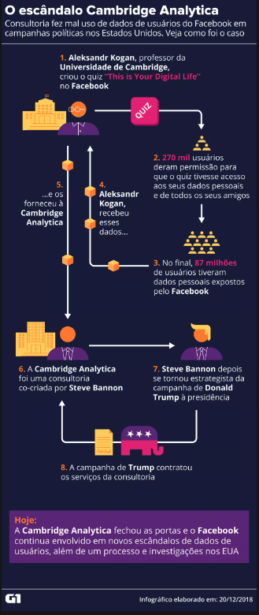

# Materiais Extras

## IA jogando jogos

O canal brasileiro "Universo Programado", criado por Victor Dias, utiliza de seus conhecimentos em programação e inteligência artificial para criar programas que aprendem a jogar diversos jogos, além de outras aplicações de inteligência artificial. Veja o vídeo abaixo, onde ele criou uma IA para jogar o jogo da Google, o T-Rex Game.

<iframe width="560" height="315"  src="https://www.youtube.com/embed/NZlIYr1slAk" title="YouTube video player" frameborder="0" allow="accelerometer; autoplay; clipboard-write; encrypted-media; gyroscope; picture-in-picture" allowfullscreen></iframe>

## Regulação

Segundo o 2022 AI Index Report Master, o número de registros legislativos sobre inteligência artificial em 25 países subiu de 1 no ano de 2016 para 18 em 2021, onde Espanha, Reino Unido e Estados Unidos aprovaram o maior números de leis relacionadas à IA em 2021, onde cada um contribui com 3 novas regulações. Uma das leis aprovadas em 2021:

<b>Lei N:2021-1485 de November 15, 2021:</b> Estabelece um sistema de monitoramento para avaliar os impactos ambientais do setor digital, que representa a maior fonte de emissão de gases de efeito estufa na França, em particular, a inteligência artificial.

Apesar dessa lei em específico ser mais um problema do setor tecnólogico do que de inteligência artificial em si, é possível observar uma clara preocupação dos governos ao redor do mundo sobre IA, visto que é um tema que sempre gera discussões, achismos e medo sobre a população.

## Utilização de dados em política

No ano de 2018, um caso envolvendo a empresa Cambridge Analytica e o Facebook, onde os dados de 87 milhões de usuários foram utilizados a serviço da campanha de Donald Trump na eleição presidencial americana de 2016.

A Cambridge Analytica era uma empresa de análise de dados que trabalhou o time responsável pela campanha do ex-presidente Donald Trump nas eleições de 2016, a empresa teria comprado acesso a informações pessoais de usuários do Facebook e usado esses dados para criar um sistema que permitiu predizer e influenciar as escolhas dos eleitores nas urnas. 

Essas informações foram coletadas por um aplicativo chamado "this is your digital life", que pagou a centenas de milhares de usuários pequnas quantias para que eles fizessem um teste de personalidade e concordassem em ter seus dados coletados para uso acadêmico.

O grande problema nessa questão foi que o aplicativo também coletou as informações dos amigos de Facebook das pessoas que fizeram o teste. Ou seja, se uma pessoa respondesse o quiz, estaria entregando informações privadas não apenas do seu perfil, mas de todos os seus amigos.

O aplicativo se aproveitou de uma "brecha" nas normas do Facebook, na época, a política da plataforma permitia à aplicativos externos a coleta de dados de amigos das pessoas, mas dizia que eles deveriam ser usados apenas para melhorar a experiência do próprio usuário no aplicativo.

Christopher Wylie, um funcionário da Cambridge Analytica, afirma que, como 270 mil pessoas fizeram o teste de personalidade, por meio do acesso à rede de amigos dessas pessoas, os dados de cerca de 50 milhões de usuários foram coletados, sem autorização. A maioria dos usuários seriam eleitores norte-americanos.

De acordo com Wylie, os dados vendidos à Cambridge Analytica teriam sido usados para catalogar o perfil das pessoas e, então, direcionar, de forma mais personalizada, materiais pró-Trump e mensagens contrárias à adversária dele, a democrata Hillary Clinton.

## Referências

> Escândalo de dados, g1. Disponível em: https://g1.globo.com/economia/tecnologia/noticia/entenda-o-escandalo-de-uso-politico-de-dados-que-derrubou-valor-do-facebook-e-o-colocou-na-mira-de-autoridades.ghtml, acesso em 27 de jun. de 2022.
