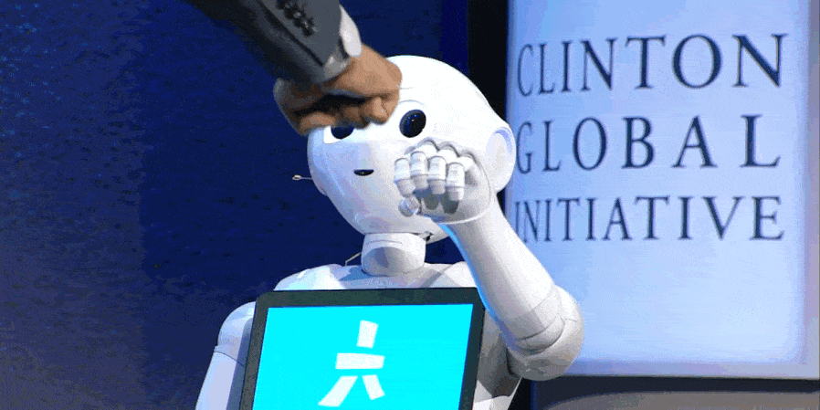
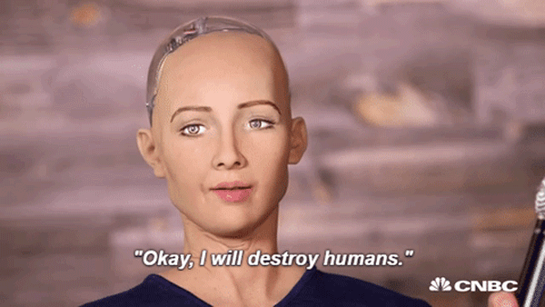

# Impressão Geral

Inteligência artificial é um tópico que vem crescendo bastante em popularidade nos últimos anos, gerando diversas oportunidades de carreiras e estudos, além de ser inspiração diversos filmes e séries atuais, o que com certeza contribui para o aumento do interesse geral.

Minha impressão sobre o tema é que ia pode ser basicamente uma forma de automatizar tarefas repetitivas, tanto físicas como digitais, de forma que tais tarefas sejam executadas de forma mais veloz e mais eficaz, o que levaria com certeza ao desaparecimento de certas profissões.

Algumas funcionalidades podem ser utilizadas em conjuntos com outros profissionais, como por exemplo uma ia que analisa os dados de um paciente e oferece um diagnóstico mais preciso do que o médico, isso não substituiria completamente nenhuma profissão da medicina, mas sim ajudaria.

Assim como o surgimento de outras tecnologias através das revoluções industriais também trouxeram novas profissões, acredito que o mesmo acontecerá com a inteligência artificial, de forma que a sociedade irá se adaptar às mudanças que essa tecnologia proporcionará.

