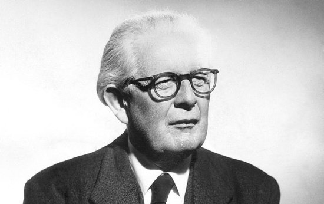

# Apresentação de Problemas relacionados

Neste primeiro portfólio este tópico será apresentado a partir da solução de uma lista de 8 questões propostas pelo professor da disciplina.

**O que é inteligência ?**

Segundo o dicionário, inteligência é a faculdade de conhecer, compreender e aprender.

Segundo o Jean Piaget(1986-1980), um dos mais importantes pensadores do século XX, inteligência é a solução de um problema novo para o indivíduo, é a coordenação dos meios para atingir um determinado fim, que não é acessível de maneira direta.

**O que é inteligência artificial ?**

O termo “inteligência artificial” nasceu em 1956 no famoso encontro de Dartmouth e é, basicamente, um ramo de pesquisa da computação que busca fazer com que sistemas ou máquinas sejam capazes de imitar a inteligência humana com o objetivo de realizar tarefas, as IAs também podem se aprimorar iterativamente com base nas informações que coletam.

**Quais as áreas do conhecimento que contribuem para o campo de IA e quais suas contribuições ?**

<b>Filosofia: </b> Refinamento das ideias e compreensão do universo ao qual a máquina está contida.

<b>Matemática: </b> Representação do problema de uma forma que possa ser entendido e resolvido por máquinas.

<b>Economia: </b> Análise de riscos e ganhos em um futuro não tão próximo.

<b>Neurociência: </b> Como a informação deve ser processada.

<b>Psicologia: </b> Como os seres humanos pensam.

<b>Engenharia da Computação: </b> Avanços na construção de hardware, que interferem diretamente na capacidade do sistema em executar suas tarefas.

<b>Cibernética: </b> Como operar as máquinas para que elas possam realizar seus objetivos.

<b>Linguística: </b> Relacionamento entre a linguagem e o pensamento.

**O que foi o Dartmouth Summer Research Project on Artificial Intelligence de 1956 ?**

Foi um workshop que reuniu algumas das mais brilhantes mentes da computação, é considerado o marco inicial da inteligência artificial. Este encontro foi baseado na ideia de que todos os aspectos da aprendizagem ou qualquer outra característica da inteligência podem ser descritos com tanta precisão que uma máquina pode ser capaz de simulá-los.

**O que são os invernos de IA ?**

Os invernos de IA foram períodos em que as expectativas sobre as possibilidades da inteligência artificial entravam em declínio, juntamente com isso os investimentos na área também diminuíram, levando algumas empresas à falência

**Explique o que é o problema da porta XOR e por quê esse problema gerou um desânimo na área de redes neurais.**

Os primeiros algoritmos de inteligência artificial utilizavam o Perceptron como método para pesar evidências a fim de tomar decisões.

O problema é que um único Perceptron consegue resolver apenas problemas que possam ser representados como funções linearmente separáveis e no mundo real os dados raramente são representados dessa forma, um exemplo simples é a porta xor.

Essa falha em resolver problemas mais complexos causou uma queda de expectativa muito grande, e consequentemente, ao que ficou conhecido como primeiro Winter AI. 

**Explique o que a IA pode fazer hoje em relação a: fala, o biomimetismo, a exploração espacial, jogos, navegação na internet, veículos autônomos e vigilância.**

<b>Fala: </b> Algoritmos de reconhecimento de voz integrados em assistentes virtuais, como a Alexa, faz com que a mesma só obedeça comandos da voz cadastrada no sistema, gerando maior segurança em ambientes automatizados controlados pela IA.

<b>Biomimetismo: </b> Um exemplo de aplicação de biomimetismo e IA é o chatbot, que é utilizado para responder dúvidas frequentes dos usuários de determinado sistema, entregando a informação de forma mais acessível e utilizando uma linguagem mais natural.

<b>Exploração espacial: </b> Interagir com um robô que está em outro planeta pode ser bem difícil considerando o delay entre um comando e outro, dessa forma a IA é uma solução que permite ao sistema integrado ao hardware tomar as próximas decisões por conta própria.

<b>Jogos: </b> No jogo Need For Speed, um algoritmo de inteligência artificial é utilizado para criar vários tipos de carros em uma corrida, baseando-se em um deles. Dessa forma o  tempo de criação dos elementos é reduzido e a variedade de carros é aumentada.

<b>Navegação na Internet: </b> A IA na navegação pode ser utilizada de forma a analisar os dados do usuário e recomendar os anúncios que mais se encaixam com o perfil da pessoa, entregando ADs direcionados a cada perfil.

<b>Veículos autônomos: </b> Com IA integrada ao sistema dos veículos é possível que o automóvel se locomova sem a necessidade de um condutor.

<b>Vigilância: </b> Com o avanço da visão computacional alguns sistemas de vigilância podem ser capazes de identificar pessoas em meio a multidões e, por exemplo, rapidamente descobrir um indivíduo é foragido da justiça ou não. Como <a href="https://g1.globo.com/mundo/noticia/homem-e-reconhecido-e-preso-em-meio-a-publico-de-60-mil-em-show-na-china.ghtml" target="blank">esse caso</a> que aconteceu na China.

**Discorra sobre os impactos da IA na sociedade humana, considerando vantagens e riscos.**

A inteligência artificial vem crescendo bastante em popularidade nos últimos anos, graças aos avanços na área muitas tarefas que eram ou seriam realizadas utilizando mão de obra humana pode ser substituída por máquinas, o que gera uma maior eficácia e acurácia, por outro lado é preciso ter cuidado durante o treinamento da tecnologia para que preconceitos e achismos do programador não afetem o julgamento da IA, como por exemplo o <a href="https://canaltech.com.br/inteligencia-artificial/ia-projetada-para-dar-conselhos-eticos-se-mostra-um-bot-racista-e-preconceituoso-200007/" target="blank"> Projeto Ask Delphi </a>.

