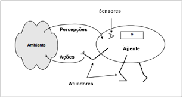
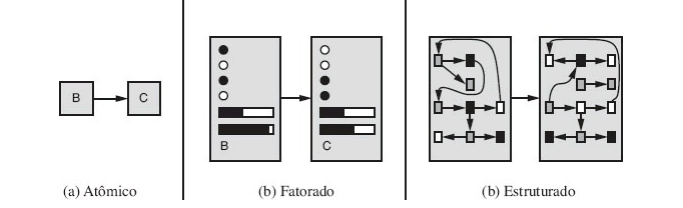

# Conceitos a serem discutidos

## Ambientes de tarefa

Ambientes são essencialmente os "problemas" para quais os agentes racionais são projetados para resolverem. Existem vários tipos de ambientes, e cada tipo, afeta diretamente o projeto apropriado para o programa do agente. Ao projetar um agente, a primeira tarefa deve ser sempre especificar o ambiente de tarefa de forma tão complexa quanto possível.

### Completamente observável vs Parcialmente Observável

Se os sensores de um agente permitem acesso ao estado completo do ambiente em cada instante, detectando todos os aspectos que são relevantes para a escolha da ação, então o ambiente de tarefa é completamente observável, esse tipo de ambiente é conviente pois o agente não precisa manter qualquer estado interno para acompanhar as mudanças do mundo.

Um ambiente pode ser parcialmente observável devido a algum ruído, a sensores imprecisos ou porque partes do estado estão fora do alcance do sensor. O ambiente será não observável se o agente não possuir sensores.

### Agente único vs multiagente

Um agente que resolve um jogo de palavras cruzadas sozinho é um agente único, enquanto um agente que joga xadrez é um multiagente. Apesar de simples é preciso se atentar a algumas sutilezas, como por exemplo se uma entidade pode ou não ser vista como um agente, multiagentes podem ser classificados em competitivos ou cooperativos.

### Determinístico vs Estocástico

Caso o próximo estado do ambiente seja completamente determinado pelo estado atual e pela ação a ser executada pelo agente, então o ambiente é determinístico, caso contrário, ele é estocástico. Um ambiente não determinístico é aquele em que as ações são caracterizadas por seus possíveis resultados, sem probabilidade associada a ele.

### Episódico vs Sequencial

Um ambiente é episódico se a experiência do agente pode ser dividida em episódios atômicos, onde em cada um o agente recebe uma percepção e em seguida executa uma única ação, é essencial que o próximo episódio não dependa das ações exxecutadas em episódios anteriores.

Um ambiente sequencial, uma decisão em um episódio pode afetar todas as decisões futuras, são exemplos desses ambientes: um jogo de xadrez e dirigir.

### Estático vs Dinâmico

Um ambiente dinâmico é aquele que pode ser alterado enquanto um agente está utilizando-o, caso contrário o ambiente é estático. Ambientes estáticos são fáceis de manipular pois o agente não precisa continuar a observar o mundo enquanto age, nem se preocupar com a passagem do tempo, já ambientes dinâmicos estão sempre perguntando ao agente o que ele deseja fazer. Caso o ambiente não muda com a passagem do tempo, mas o nível de desempenho do agente se altera, então o ambiente é semidinâmico.

### Discreto vs contínuo

A distinção entre discreto e contínuo aplica-se ao estado do ambiente, ao modo como o tempo é tratado, e às percepções e ações do agente. Por exemplo, um jogo de xadrez tem um número finito de estados distintos e um conjunto discreto de percepções e ações.

### Conhecido vs Desconhecido

Essa distinção não se refere ao ambiente em si, mas ao estado de conhecimento do agente, ou do projetista, sobre as "leis da física" no meio ambiente.

O caso mais difícil seria um onde o ambiente pode ser classificado como parcialmente observável, multiagente, estocástico, sequencial, dinâmico, contínuo e desconhecido. Dirigir é difícil em todos esses sentidos, exceto que para a maioria dos motoristas o ambiente é conhecido.

## Racionalidade

A definição do que é racional em qualquer instante dado depende de 4 fatores: A medida do desempenho que define o critério de sucesso, o conhecimento prévio que o agente tem do ambiente, as ações que o agente pode executar e por fim, a sequência de percepções do agente até o momento.

Um agente racional é aquele que faz tudo certo, em termos conceituais, toda entrada na tabela correspondente à função do agente é preenchida de forma correta. Para medir o desempenho do agente é preciso observar a sequência de estados do ambiente após as interações do agente, se a sequência for desejável, o agente teve um bom desempenho, onde essa noção de "desejável" é alcançada por uma medida de desempenho que avalia toda e qualquer sequência dada dos estados do ambiente.

É preciso ter o cuidado de distinguir racionalidade de inisciência, um agente onisciente sabe o resultado real de cada uma de suas ações e age de acordo com ele, a racionalidade maximiza o desempenho esperado. Uma escolha racional só depende da sequência de percepções até o momento atual.

Um agente racional deve ser capaz não apenas de coletar informações, mas também de aprender com o que ele percebe, um agente que se baseia no conhecimento anterior de seu projetista e não em suas próprias percepções é um agente sem autonomia.

## Agentes

Um agente é qualquer coisa que pode perceber seu ambiente através de sensores e agir sobre este ambiente através de atuadores. Um agente humano tem olhos, ouvidos e outros órgãos como sensores, e tem mãos, pernas, e outras partes do corpo que servem como atuadores.

Em termos matemáticos, o comportamento do agente é descrito pela função do agente que mapeia qualquer sequência de percepções específica para uma ação. Enquanto que o programa do agente é uma implementação concreta, executada em um sistema físico.

### Agentes de reflexo simples

Esses agentes selecionam ações com base na percepção atual, ignorando o restante do histórico de percepções, são do tipo <b>se</b> <i>condição</i> <b>então</b> <i>ação</i>.

### Agentes de reflexo baseado em modelo

O agente monitora parte do mundo que ele não pode ver agora, ou seja, o agente mantém algum tipo de estado interno que depende do histórico de percepções e assim reflete pelo menos alguns dos aspectos não observados do estado atual.

### Agentes baseados em objetivos

Nem sempre conhecer algo sobre o estado atual é o suficiente para tomar uma ação, as vez também é necessário um objetivo que descreva situações desejáveis.

### Agentes utilitários

Sozinhos, os objetivos não são realmente suficientes para gerar um comportamento de alta qualidade na maioria dos ambientes, os agentes utilitários tendem a adicionar alguma característica a mais ao objetivo, como por exemplo, velocidade, segurança, economia, etc.

## Representação de estados

### Atômico

Cada estado do mundo é indivisível, não tem estrutura interna.

### Fatorado

Um estado consiste em um vetor de valores de atributos; os valores podem ser booleanos, valores reais ou um conjunto fixo de símbolos.

### Estruturado

Um estado inclui objetos; cada um deles podem ter atributos próprios, bem como relacionamentos com outros objetos

## Referências

> RUSSEL, Stuart; NORVIG, Peter. Artificial Intelligence: A modern Approach 3 ed. Elsevier 2009.
