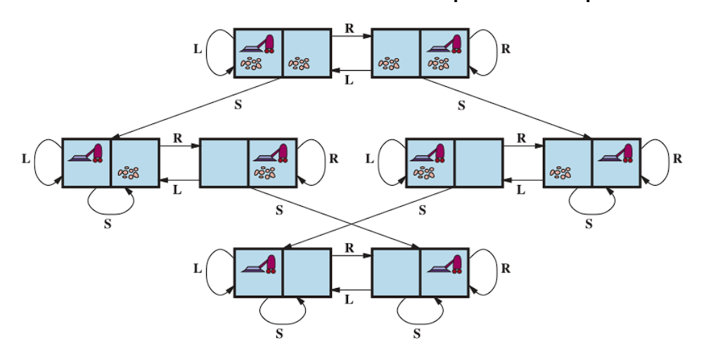
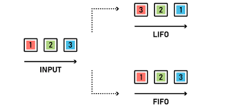
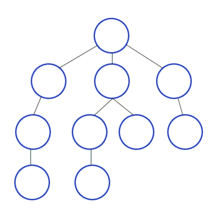

# Conceitos a serem discutidos

## Agentes de resoluções de problemas

<p style="text-indent: 20px; text-align: justify">
Os agentes inteligentes devem maximizar sua medida de desempenho, esse objetivo é às vezes simplificado se o agente pode adotar um objetivo que deseja
satisfazer. A formulação de objetivos, baseada na situação atual e na medida de desempenho do agente, é o primeiro passo para a resolução de problemas.
</p>

<p style="text-indent: 20px; text-align: justify">
Considerando que um objetivo é o conjunto de estados do mundo, a tarefa do agente é descobrir como agir para atingir esse objetivo. A formulação de problemas se trata de definir quais ações estados devem ser considerados dado um objetivo.
</p>

<p style="text-indent: 20px; text-align: justify">
Se o agente não possui nenhuma informação sobre o ambiente, ele não terá escolha a não ser tentar uma das ações de forma aleátoria, porém caso o agente conheça o ambiente ele pode decidir previamente quais ações serão tomadas em cada etapa do problema para que o objetivo final seja alcançado.
</p>

<p style="text-indent: 20px; text-align: justify">
O processo de procurar uma sequência de de ações que alcançam o objetivo é chamado de busca, onde um algoritmo de busca recebe um problema como entrada e devolve uma solução, normalmente uma sequência de ações. Depois que a solução é encontrada as ações recomendadas podem ser executadas, essa é a fase de execução.
</p>

## Exemplo de problema de mundo simplificado

<p style="text-indent: 20px; text-align: justify">
Um bom exemplo de um problema em mundo simplificado é o do aspirador de pó, ele pode ser formulado como:
</p>

<p style="text-indent: 20px; text-align: justify">
<b>Estados:</b> Existem duas células, em cada uma delas pode ou não haver sujeira, e o nosso agente, o aspirador de pó, pode estar em qualquer uma delas.
</p>

<p style="text-indent: 20px; text-align: justify">
<b>Estado Inicial:</b> Qualquer uma das células.
</p>

<p style="text-indent: 20px; text-align: justify">
<b>Ações:</b> Limpar a célula, se mover para a outra célula.
</p>

<p style="text-indent: 20px; text-align: justify">
<b>Modelo de transição:</b> limpar a célula remove a sujeira e se mover para a outra célula desloca o agente para a direção da outra célula.
</p>

<p style="text-indent: 20px; text-align: justify">
<b>Objetivo:</b> Verificar se todas as células estão limpas
</p>

<p style="text-indent: 20px; text-align: justify">
<b>Custo de ação:</b> Cada passo custa 1
</p>

<p style="text-indent: 20px; text-align: justify">
Todos os possíveis estados desse mundo pode ser observado na imagem abaixo: 
</p>



## Algoritmos de busca

<p style="text-indent: 20px; text-align: justify">
Algoritmos de busca exigem uma estrutura de dados para manter o controle da árvore de busca que está sendo construída. Para cada nó n da árvore, temos uma estrutura que contém quatro componentes:
</p>

<p style="text-indent: 20px; text-align: justify">
<b>Estado:</b> O estado no espaço ao qual o nó corresponde.
</p>

<p style="text-indent: 20px; text-align: justify">
<b>Pai:</b> O nó na árvore de busca que gerou esse nó.
</p>

<p style="text-indent: 20px; text-align: justify">
<b>Ação:</b> A ação que foi aplicada ao pai para gerar o nó
</p>

<p style="text-indent: 20px; text-align: justify">
<b>Custo do caminho:</b> O custo do nó inicial até o nó final.
</p>

### Desempenho

<p style="text-indent: 20px; text-align: justify">
O desempenho de um algoritmo pode ser avaliado em 4 aspectos principais:
</p>

<p style="text-indent: 20px; text-align: justify">
<b>Completude:</b> O algoritmo oferece a garantia de encontrar uma solução quando ela existir?
</p>

<p style="text-indent: 20px; text-align: justify">
<b>Otimização de custo:</b> o algoritmo garante o menor custo entre todas as soluções?​
</p>

<p style="text-indent: 20px; text-align: justify">
<b>Complexidade de tempo:</b> Quanto tempo ele leva para encontrar uma solução?
</p>

<p style="text-indent: 20px; text-align: justify">
<b>Complexidade de espaço:</b> Quanta memória é necessária para executar a busca?
</p>

<p style="text-indent: 20px; text-align: justify">
A complexidade de tempo e a complexidade de espaço de memória são sempre consideradas em relação a alguma medida da dificuldade do problema. Em ciência da computação teórica, a medida típica é o tamanho do grafo do espaço de estados, | V | + | E |, onde V é o conjunto de vértices (nós) do grafo e E é o conjunto de arestas (linhas). 
</p>

### Filas e Pilhas

<p style="text-indent: 20px; text-align: justify">
Os algoritmos de busca normalmente são executados utilizando as seguintes estrutura de dados: 
</p>

<p style="text-indent: 20px; text-align: justify">
<b>fila FIFO:</b> O primeiro elemento a ser inserido na estrutura é o primeiro a ser retirado, normalmente utilizado no algoritmo breadth-first search.
</p>

<p style="text-indent: 20px; text-align: justify">
<b>pilha LIFO:</b> O último elemento a ser inserido na estrutura é o primeiro a ser retirado, normalmente utilizado no algoritmo depth-first search, pode ser substituida pela pilha de recursão.
</p>

<p style="text-indent: 20px; text-align: justify">
<b>Fila de prioridade:</b> O primeiro elemento a ser retirado é definido por algum tipo de função, em algumas linguagens, como o C++, essa função retorna o menor valor da fila, é utlizada no algoritmo best-first search.
</p>



### Busca desinformada

<p style="text-indent: 20px; text-align: justify">
Esse tipo de busca ocorre quando o agente não possui nenhum tipo de informação adicional sobre os estados, além daquelas fornecidas na definição do problema. Tudo o que elas podem fazer é gerar sucessores e diferenciar um estado objetivo de um estado não objetivo.
</p>

#### Depth First Search

<p style="text-indent: 20px; text-align: justify">
A Depth First Search (DFS) sempre expande o nó mais profundo na
borda atual da árvore de busca, imediatamente até o nível mais profundo da árvore de busca, onde os nós não têm sucessores. À medida que esses nós são expandidos, eles são retirados da borda e, então, a busca “retorna” ao nó
seguinte mais profundo que ainda tem sucessores inexplorados.
</p>



<p style="text-indent: 20px; text-align: justify">
Exemplo de código em Python:
</p>

```python
# Using a Python dictionary to act as an adjacency list
graph = {
  '5' : ['3','7'],
  '3' : ['2', '4'],
  '7' : ['8'],
  '2' : [],
  '4' : ['8'],
  '8' : []
}

visited = set() # Set to keep track of visited nodes of graph.

def dfs(visited, graph, node):  #function for dfs
    if node not in visited:
        print (node)
        visited.add(node)
        for neighbour in graph[node]:
            dfs(visited, graph, neighbour)

# Driver Code
print("Following is the Depth-First Search")
dfs(visited, graph, '5')
```

#### Breadth First Search

<p style="text-indent: 20px; text-align: justify">
A Breadth First Search (BFS) é uma estratégia simples em que o nó raiz é expandido primeiro, em seguida todos os sucessores do nó raiz são expandidos, e depois os sucessores desses nós, e assim por diante até que todos os nós tenham sido visitados.
</p>


<p style="text-indent: 20px; text-align: justify">
Exemplo de código em Python:
</p>

```python
graph = {
  '5' : ['3','7'],
  '3' : ['2', '4'],
  '7' : ['8'],
  '2' : [],
  '4' : ['8'],
  '8' : []
}

visited = [] # List for visited nodes.
queue = []     #Initialize a queue

def bfs(visited, graph, node): #function for BFS
  visited.append(node)
  queue.append(node)

  while queue:          # Creating loop to visit each node
    m = queue.pop(0)
    print (m, end = " ")

    for neighbour in graph[m]:
      if neighbour not in visited:
        visited.append(neighbour)
        queue.append(neighbour)

# Driver Code
print("Following is the Breadth-First Search")
bfs(visited, graph, '5')    # function calling
```

#### Uniform Cost Search

<p style="text-indent: 20px; text-align: justify">
Quando todos os custos de passos forem iguais, a busca em largura será ótima porque sempre expande o nó mais raso não expandido. Através de uma simples extensão, podemos encontrar um algoritmo que é ótimo para qualquer função de custo do passo. Em vez de expandir o nó mais raso, a busca de custo uniforme expande o nó n com o custo de caminho g(n) mais baixo. Isso é feito através do armazenamento da borda como uma fila de prioridade ordenada por g.
</p>

<p style="text-indent: 20px; text-align: justify">
Exemplo de código em Python:
</p>

```python
# returns the minimum cost in a vector( if
# there are multiple goal states)
def uniform_cost_search(goal, start):

	# minimum cost upto
	# goal state from starting
	global graph,cost
	answer = []

	# create a priority queue
	queue = []

	# set the answer vector to max value
	for i in range(len(goal)):
		answer.append(10**8)

	# insert the starting index
	queue.append([0, start])

	# map to store visited node
	visited = {}

	# count
	count = 0

	# while the queue is not empty
	while (len(queue) > 0):

		# get the top element of the
		queue = sorted(queue)
		p = queue[-1]

		# pop the element
		del queue[-1]

		# get the original value
		p[0] *= -1

		# check if the element is part of
		# the goal list
		if (p[1] in goal):

			# get the position
			index = goal.index(p[1])

			# if a new goal is reached
			if (answer[index] == 10**8):
				count += 1

			# if the cost is less
			if (answer[index] > p[0]):
				answer[index] = p[0]

			# pop the element
			del queue[-1]

			queue = sorted(queue)
			if (count == len(goal)):
				return answer

		# check for the non visited nodes
		# which are adjacent to present node
		if (p[1] not in visited):
			for i in range(len(graph[p[1]])):

				# value is multiplied by -1 so that
				# least priority is at the top
				queue.append( [(p[0] + cost[(p[1], graph[p[1]][i])])* -1, graph[p[1]][i]])

		# mark as visited
		visited[p[1]] = 1

	return answer

# main function
if __name__ == '__main__':

	# create the graph
	graph,cost = [[] for i in range(8)],{}

	# add edge
	graph[0].append(1)
	graph[0].append(3)
	graph[3].append(1)
	graph[3].append(6)
	graph[3].append(4)
	graph[1].append(6)
	graph[4].append(2)
	graph[4].append(5)
	graph[2].append(1)
	graph[5].append(2)
	graph[5].append(6)
	graph[6].append(4)

	# add the cost
	cost[(0, 1)] = 2
	cost[(0, 3)] = 5
	cost[(1, 6)] = 1
	cost[(3, 1)] = 5
	cost[(3, 6)] = 6
	cost[(3, 4)] = 2
	cost[(2, 1)] = 4
	cost[(4, 2)] = 4
	cost[(4, 5)] = 3
	cost[(5, 2)] = 6
	cost[(5, 6)] = 3
	cost[(6, 4)] = 7

	# goal state
	goal = []

	# set the goal
	# there can be multiple goal states
	goal.append(6)

	# get the answer
	answer = uniform_cost_search(goal, 0)

	# print the answer
	print("Minimum cost from 0 to 6 is = ",answer[0])

# This code is contributed by mohit kumar 29

```

### Busca informada

<p style="text-indent: 20px; text-align: justify">
Esta é a estratégia em que utiliza conhecimento de um problema específico além da definição do problema em si, pode encontrar soluções de forma mais eficiente do que uma estratégia de busca desinformada.
</p>

#### Greedy Search

<p style="text-indent: 20px; text-align: justify">
A busca gulosa de melhor escolhaa tenta expandir o nó que está mais próximo do objetivo, com o fundamento de que isso pode conduzir a uma solução rapidamente. Assim, ela avalia os nós usando apenas a função heurística, ou seja, f(n) = h(n). A busca gulosa de melhor escolha em árvore também é incompleta, mesmo em um espaço de estados finito, exatamente como a busca em profundidade.
</p>

#### A\* Search

<p style="text-indent: 20px; text-align: justify">
A forma de solução mais amplamente conhecida da busca de melhor escolha é chamada de busca A* (pronuncia-se “busca A estrela”). Ela avalia os nós através da combinação de g(n), o custo para alcançar o nó, e h(n), o custo para ir do nó ao objetivo:
</p>

<p style="text-indent: 20px; text-align: center">
f(n) = g(n) + h(n).
</p>

<p style="text-indent: 20px; text-align: justify">
Uma vez que g(n) dá o custo do caminho desde o nó inicial até o nó n e h(n) é o custo estimado do
caminho de menor custo de n até o objetivo, teremos
</p>

<p style="text-indent: 20px; text-align: center">
f (n) = custo estimado da solução de menor custo através de n.
</p>

<p style="text-indent: 20px; text-align: justify">
Assim, se estamos tentando encontrar a solução de menor custo, algo razoável para tentar emprimeiro lugar, seria o nó com o menor valor de g(n) + h(n). Acontece que essa estratégia é mais do que apenas razoável: desde que a função heurística h(n) satisfaça certas condições, a busca A* será
completa e ótima. O algoritmo é idêntico à BUSCA-DE-CUSTO-UNIFORME, exceto que A* usa g + h em vez de g.
</p>

#### Funções Heurísticas

<p style="text-indent: 20px; text-align: justify">
A primeira condição requerida para otimalidade é que h(n) seja uma heurística admissível. Uma heurística admissível é a que nunca superestima o custo de atingir o objetivo. Devido à g(n) ser o custo real para atingir n ao longo do caminho atual, e f(n) = g(n) + h(n), temos como consequência imediata que f(n) nunca irá superestimar o verdadeiro custo de uma solução ao longo do caminho atual através de n.
</p>

## Algoritmos Genéticos

<p style="text-indent: 20px; text-align: justify">
Um algoritmo genético é uma técnica de busca utilizada na ciência da computação para achar soluções aproximadas em problemas de otimização e busca, fundamentado principalmente pelo americano John Henry Holland. Algoritmos genéticos são uma classe particular de algoritmos evolutivos que usam técnicas inspiradas pela biologia evolutiva como hereditariedade, mutação, seleção natural e recombinação (ou crossing over).
</p>

<p style="text-indent: 20px; text-align: justify">
Esses algoritmos são implementados como uma simulação de computador em que uma população de representações abstratas de solução é selecionada em busca de soluções melhores. A evolução geralmente se inicia a partir de um conjunto de soluções criado aleatoriamente e é realizada por meio de gerações. A cada geração, a adaptação de cada solução na população é avaliada, alguns indivíduos são selecionados para a próxima geração, e recombinados ou mutados para formar uma nova população. A nova população então é utilizada como entrada para a próxima iteração do algoritmo.
</p>

## Referências

> RUSSEL, Stuart; NORVIG, Peter. Artificial Intelligence: A modern Approach 3 ed. Elsevier 2009.

> Depth First Search in Python (with Code) | DFS Algorithm, FavTutor. Disponível em: https://favtutor.com/blogs/depth-first-search-python, acesso em 31 de jul. de 2022.

> Breadth First Search in Python (with Code) | BFS Algorithm, FavTutor. Disponível em: https://favtutor.com/blogs/breadth-first-search-python, acesso em 31 de jul. de 2022.

> Uniform-Cost Search (Dijkstra for large Graphs), Geeks For Geeks. Disponível em: https://www.geeksforgeeks.org/uniform-cost-search-dijkstra-for-large-graphs/, acesso em 31 de jul. de 2022.

> Algoritmo genético, Wikpedia. Disponível em: https://pt.wikipedia.org/wiki/Algoritmo_genético, acesso em 31 de jul. de 2022.
