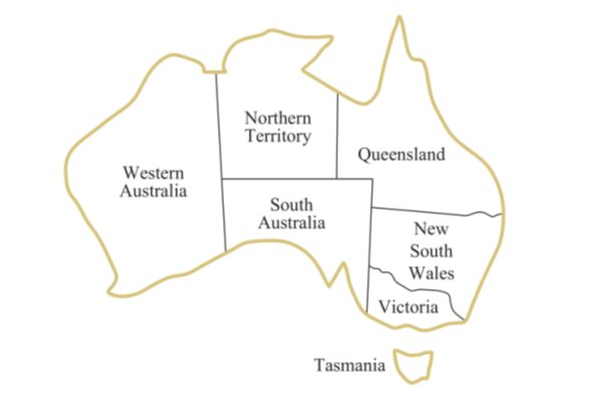
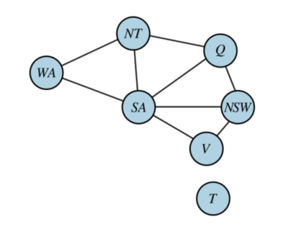

# Conceitos a serem discutidos

## Problemas de satisfação de condições

Os algoritmos de busca CSPs buscam aproveitar a estrutura de estados e utilizam heurísticas de propósito geral em vez de heurísticas específicas de problemas para permitir a solução de problemas complexos. A ideia principal é eliminar grande parte do espaço de busca de uma vez só através da identificação de combinações de variável/valor que violam as restrições.

Um problema de satisfação de condições consiste em três componentes, X, D e C:

<ul>
<li>X é um conjunto de variáveis, {X1,..., Xn}. </li>
<li>D é um conjunto de domínios, {D1,...,Dn}, um para cada variável.</li>
<li>C  é um conjunto de restrições que especificam combinações de valores possíveis.
</li>
</ul>

Para resolver um CSP é necessário definir um conjunto de estados e a noção de solução. Cada estado em um CSP é definido por atribuições de valroes a algumas ou todas as variáveis. Uma atribuição que não viola nenhuma restrição é chamada de atribuição consistente. Uma atribuição completa é aquela em que cada variável é atribuída, e uma solução para um CSP é uma atribuição consistente e completa.

## Problema exemplo: Colorindo Mapas

Considerando o mapa acima, a tarefa é colorir cada região com uma das 3 cores: vermelho, verde ou azul. De forma que duas regiões vizinhas não sejam coloridas com a mesma cor.

Esse problema pode ser visto como um CSP, onde os componentes são:

<ul>
<li>X = { WA, NT, SA, Q , NSW, V, T } </li>
<li>D = { azul, verde, vermelho } </li>
<li>C  = { SA ≠ WA, SA ≠ NT, SA ≠ Q, SA ≠ NSW, SA ≠ V, WA ≠ NT, NT ≠ Q, Q ≠ NSW, NSW ≠ V }.
</li>
</ul>

Onde SA ≠ WA é uma abreviação de {{SA, WA}, SA ≠ WA}.

É possível visualizar um CSP como um grafo de restrições, onde os nós representam as variáveis do problema e uma aresta conecta quaisquer variáveis que participem de uma restrição.

## Tipos de condições

### Unitária

Restringe o valor de uma única variável. Por exemplo, no probema de coloração do mapa poderia existir uma restrição que impedisse de colorir a região de Victoria com a cor azul. Isso pode ser expresso da forma { V ≠ azul }.

### Binária

Relaciona duas variáveis, por exemplo WA ≠ NT.

### Ternária

Relaciona três variáveis, por exemplo X > Y > Z.

### Global

Envolve um número arbitrário de variáveis, não necessáriamente todas as variáveis do problema.

### Restrições de preferência

Indica as soluções preferidas.

## Propagação de condições

Na busca regular em espaços de estados, um algoritmo pode fazer apenas uma coisa: busca. Em CSPs há uma escolha: um algoritmo pode buscar (escolher uma nova atribuição para a variável de várias possibilidades) ou fazer um tipo específico de inferência chamada propagação de restrições:
utilizando as restrições para reduzir o número de valores válidos para uma variável, o que, por sua vez, pode reduzir os valores válidos para outra variável, e assim por diante. A propagação de restrição pode ser interligada com a busca ou pode ser feita como uma etapa de pré-processamento, antes que a busca seja iniciada. Às vezes, esse pré-processamento pode resolver todo o problema e, assim, não é requerida nenhuma busca.

A ideia-chave é a consistência local. Se tratarmos cada variável como um nó em um grafo e cada restrição binária como um arco, o processo de aplicar a consistência local em cada parte do grafo faz com que os valores inconsistentes sejam eliminados em todo o grafo. Existem diferentes tipos de consitência local.

### Consistência de Nós

Uma variável, ou o nó, no caso de grafos, é nó-consistente se todos os valores no domínio da variável satisfazem as restrições unárias da variável. Por exemplo, no exemplo do mapa da Austrália poderiamos adicionar a restrição de que a região de Victoria não pode assumir a cor Verde, então o domínio inicial { azul, verde, vermelho }, seria transformado em { azul, vermelho } para que fosse transformada em nó-consistente. O Grafo é nó-consistente se todos os nós forem nó-consistentes.

### Consistência de Arco

Uma variável em um CSP é arco-consistente se todos os valores em seu domínio satisfizerem as restrições binárias da variável. Um grafo é arco-consistente se cada variável for arco-consistente com todas as outras variáveis.

### Consistência de Caminho

A consistência de caminho fixa as restrições binárias utilizando restrições implícitas que são inferidas pela verificação das triplas de variáveis. Um conjunto de duas variáveis { Xi, Xj } é caminho-consistente em relação a uma terceira variável Xm se, para cada atribuição { Xi = a, Xj = b} consistente com as restrições em { Xi, Xj }, houver uma atribuição para Xm que satisfaça as restrições em { Xi, Xm } e { Xm, Xj }.

### Consistência K

O CSP é k-consistente se, para qualquer conjunto de k − 1 variáveis e para qualquer atribuição consistente para aquelas variáveis, um valor consistente puder sempre ser atribuído a para a k-ésima variável. 1- consistência determina que, dado o conjunto vazio, podemos tornar qualquer conjunto de uma
variável consistente: isso é o que se chama consistência de nó. 2-consistência é a consistência de arco. Para grafos de restrição binária, 3-consistência é a consistência de caminho.

### Condições Globais

Algoritmo simples: primeiro, retire qualquer variável da restrição que
tenha um domínio avulso e exclua o valor dessa variável dos domínios das variáveis restantes. Repita enquanto existirem variáveis avulsas. Se em algum momento for produzido um domínio vazio ou restarem mais variáveis do que valores de domínio, foi detectada uma inconsistência.

## Pesquisa Backtracking para CSPs

A expressão busca com retrocesso é utilizada para indicar uma busca em profundidade que escolhe valores para uma variável de cada vez e que efetua o retrocesso quando uma variável não tem valores válidos restantes a serem atribuídos. Ele escolhe repetidamente uma variável não atribuída e depois experimenta todos os valores no domínio da variável, por vez, tentando encontrar uma solução. Se for detectada uma inconsistência a função retorna falha, fazendo com que a chamada anterior tente outro valor.

O algoritmo de backtracking pode ser melhorado usando heurísticas independentes de domínio, como por exemplo, ordenação de variáveis e valores,

## Busca local para CSPs

Os algoritmos de busca local se mostram muito eficazes na resolução de vários CPSs. Eles utilizam uma formulação de estados completos: o estado inicial atribui um valor a cada variável e a busca altera o valor de uma variável de cada vez.

Normalmente, o palpite inicial viola várias restrições. O ponto de busca local é eliminar as restrições violadas.
Na escolha de um novo valor para uma variável, a heurística mais óbvia é selecionar o valor que resulta no número mínimo de conflitos com outras variáveis — a heurística de conflitos mínimos.

## Estrutura dos problemas

Uma das formas de lidar com problemas complexos é dividi-los em subproblemas mais simples.

A independência de solução pode ser checada simplesmente procurando por componentes conectados no grafo de restrições, cada componente corresponde a um subproblema CSP.

Problemas completamente independentes são raros, mas, felizmente, algumas outras estuturas de grafos também são fáceis de resolver, por exemplo, um grafo de restrição é uma árvore quando duas variáveis quaisquerestiver ligadas por apenas uma aresta, e qualquer CSP estruturado em árvore pode ser resolvido em tempo linear em relação ao número de nós.

O ponto por trás disso é uma nova noção de consistência, chamada de consistência orientada de arco. O CSP é definido como arco orientado consistente sob uma ordenação de variáveis X1, X2, ..., Xn se e somente se cada Xi for arco-consistente com cada Xj para j > i.

Para resolver um CSP estruturado em árvore, primeiramente é escolhido um nó para ser a raiz da árvore e então uma ordenação das variáveis de tal forma que cada variável apareça após o seu pai na árvore, isso é denominado ordenação topológica.

Qualquer árvore com N nós tem N-1 arestas, então é possível transformar esse grafo em arco-orientado consistente em N etapas. Uma vez que tenhamos um grafo arco-orientado consistente, podemos proceder diretamente à lista de variáveis e escolher algum valor restante, desde que cada ligação de um pai com seu filho seja arco-consistente, sabe-se que, para qualquer valor que seja definido como o pai, haverá um valor válido para o filho, o que significa que não será necessário retroceder, o que permite que prossigamos linearmente com o algoritmo de busca.

> RUSSEL, Stuart; NORVIG, Peter. Artificial Intelligence: A modern Approach 3 ed. Elsevier 2009.
