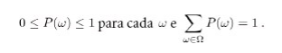
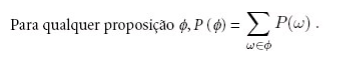
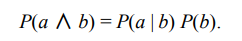
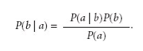
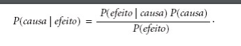
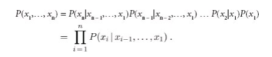
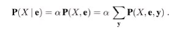

# Conceitos a serem discutidos

## Agindo sob incerteza

Os agentes podem precisar lidar com a incerteza, seja devido à observabilidade parcial, ao não determinismo ou a uma combinação dos dois. Um agente pode não saber ao certo em que estado está
ou onde terminará após uma sequência de ações.

Até agora os agentes estudados foram projetados para lidarem com a incerteza, mantendo o controle de um estado de crença, uma representação do conjunto de todos os estados possíveis do mundo em que possam estar, e gerando um planto de contigência que trate de qualquer eventualidade possível que seus sensores possam relatar durante a exxecução. Entretanto, apesar de suas muitas virtudes, essa a bordagem tem desvantagens significativas quando tomada literalmente como uma receita para a crianção de programas do agente, tais como:

Ao interpretar a informação parcial do sensor, um agente lógico deve considerar ação logicamente possível das observações, não importa o quão improvável seja, isso leva a representações de estados de crença impossivelmente grandes e complexos.

Um plano de contingência correto que lida com toda eventualidade pode crescer arbitrariamente
e deve considerar as contingências arbitrariamente improváveis.

## Resumindo incerteza

Vamos considerar um exemplo de raciocínio incerto: o diagnóstico de dor de dente de um paciente. Vamos tentar definir regras para diagnóstico
odontológico utilizando a lógica proposicional, de forma que possamos ver como a abordagemlógica se desenvolve. Considere a regra simples a seguir

DorDeDente ⇒ Cárie

O problema é que essa regra está errada. Nem todos os pacientes com dores de dentes têm cáries; alguns deles têm gengivite, abscessos ou algum dentre vários outros problemas:

DorDeDente ⇒ Cárie ∨ Gengivite ∨ Abscessos…

Infelizmente, a fim de tornar a regra verdadeira, temos de adicionar uma lista quase ilimitada de causas possíveis. Poderíamos tentar transformar a regra em uma regra causal:

Cárie ⇒ DorDeDente

No entanto, essa regra também não é correta; nem todas as cáries causam dor. O único modo de corrigir a regra é torná-la logicamente exaustiva: aumentar o lado esquerdo com todas as qualificações exigidas para que uma cárie cause dor de dente.

Tentar usar a lógica de primeira ordem para lidar com um domínio como diagnóstico médico é uma abordagem falha, por três razões principais:

<strong>Complexidade: </strong> É trabalhoso demais listar o conjunto completo de antecedentes ou consequentes necessários para assegurar uma regra sem exceções, e é muito difícil usar tais regras.

<strong>Ignorância téorica: </strong> A ciência médica não tem nenhuma teoria completa para o domínio.

<strong>Ignorância prática: </strong> Ainda que todas as regras sejam conhecidas, poderíamos estar inseguros quanto a um paciente específico porque nem todos os testes necessários foram ou podem ser executados.

Na melhor das hipóteses, o agente pode apenas fornecer um grau de certeza nas sentenças relevantes. A principal ferramenta para lidar com graus de certeza será a teoria da probabilidade. um agente probabilístico pode um grau de certeza númerico entre 0 e 1.

A probabilidade proporciona um meio para resumir a incerteza que vem de nossa preguiça e ignorância, resolvendo assim o problema de qualificação. Talvez não seja possível definir com certeza o que aflinge determinado paciente, mas é possível definir uma chance de, por exemplo, 80%, o que dá um grau de 0.8, de que o paciente tenha cáriem caso ele esteja sentindo dor de dente.

## Teoria da utilidade

Um agente deve ter preferências entre os diferentes resultados dos vários planos. Um resultado específico é um estado completamente especificado. Pra isso utilizaremos a teoria da utilidade para representar e raciocinar com preferências. A teoria da utilidade diz que todo estado tem determinado grau de utilidade para um agente e que o agente preferirá estados com uma utilidade mais alta.

## Teoria de decisão

Preferências, sendo expressas por utilidades, são combinadas com as probabilidades na teoria geral de decisões racionais chamada teoria da decisão:

Teoria da decisão = teoria da probabilidade + teoria da utilidade.

A ideia fundamental da teoria da decisão é que um agente é racional se e somente se escolhe a ação que resulta na mais alta utilidade esperada, calculada como a média sobre todos os resultados possíveis da ação. Isso é chamado de princípio de utilidade máxima esperada(UME).

## Notação básica de probabilidade

Para que o agente possa representar e utilizar a informação probabilística, precisamos de uma linguagem formal. A linguagem da teoria da probabilidade tem sido tradicionalmente informal, escrita por matemáticos humanos a outros matemáticos humanos.

Na teoria da probabilidade, o conjunto de todos os mundos
possíveis é chamado de espaço amostral. Os mundos possíveis são mutuamente exclusivos e exaustivos,dois mundos possíveis não podem coexistir, e um mundo possível deve ser sempre válido.

Por exemplo, se jogamos dois dados (distintos), existem 36 mundos possíveis a considerar: (1,1), (1,2),…, (6,6). A letra grega Ω (ômega maiúsculo) é usada para se referir ao espaço amostral, e ω (ômega minúsculo) refere-se aos elementos do espaço, isto é, aos mundos possíveis particulares.

Um modelo de probabilidade totalmente especificado associa uma probabilidade numérica P(ω) a cada mundo possível.Os axiomas básicos da teoria da probabilidade dizem que todo mundo possível tem uma probabilidade entre 0 e 1 e que a probabilidade total do conjunto de mundos possíveis é 1:

Afirmações probabilísticas e consultas geralmente não são sobre mundos possíveis particulares, mas sobre os seus conjuntos. Por exemplo, poderíamos estar interessados nos casos em que os dois dados chegam ao resultado 11, os casos em que são jogados em duplas, e assim por diante.

Em teoria da probabilidade, esses conjuntos são chamados eventos. Em IA, os conjuntos são sempre descritos por proposições em uma linguagem formal. Para cada proposição, o conjunto correspondente contém apenas aqueles mundos possíveis onde a proposição é válida. A probabilidade associada a uma proposição é definida como sendo a soma das probabilidades dos mundos nos quais é válida:

Probabilidades incondicionais ou anteriores se referem a graus de certezas em proposições na ausência de qualquer outra informação. Na maioria das vezes, no entanto, temos alguma informação, geralmente chamada de evidência, que já foi revelada, nesse caso estaremos nos referindo a probabilidade condicional ou posterior.

A definição de probabilidade condicional pode ser escrita através da regra do produto:

As variáveis, na teoria da probabilidade, são chamadas de variáveis aleatórias e seus nomes começam com letra maiúscula. Assim, no exemplo do dado, Total e Dado1 são variáveis aleatórias. Cada variável aleatória tem um domínio, o conjunto de valores possíveis que pode assumir. O domínio de Total para dois dados é o conjunto {2,…, 12} e o domínio de Dado1 é {1,…, 6}. Uma variável aleatória booleana tem o domínio {verdadeiro, falso}. 

Proposições da forma A = verdadeiro é abreviada na forma a enquanto A = falso é abreviado como ¬a.​

Para variáveis contínuas, não é possível escrever toda a distribuição como um vetor porque há um número infinito de valores. Em vez disso, podemos definir a probabilidade de que uma variável aleatória assume algum valor de x como uma função parametrizada de x. 

Além de distribuições sobre variáveis simples, precisamos de uma notação para distribuições sobre variáveis múltiplas. Para isso é utilizado a vírgula. Por exemplo, P (Tempo, Cárie) indica as probabilidades de todas as combinações de valores de Tempo e de Cárie. Essa é uma tabela de probabilidades 4 × 2 chamada de distribuição de probabilidade conjunta de Tempo e de Cárie.

A partir da definição anterior dos mundos possíveis, segue que um modelo de probabilidade é completamente determinado pela distribuição conjunta de todas as variáveis aleatórias, a chamada distribuição de probabilidade conjunta completa. Por exemplo, se as variáveis são Dor de dente, Cárie e Tempo, a distribuição conjunta completa é dada por P(Cárie, Dor de dente, Tempo).

## Independência

As asserções de independência em geral se baseiam no conhecimento do domínio. Como o exemplo do tempo na dor de dente ilustra, elas podem reduzir drasticamente a quantidade de informações necessárias para especificar a distribuição conjunta total. Se o conjunto completo de variáveis puder ser dividido em subconjuntos independentes, então a distribuição conjunta total
poderá ser fatorada em distribuições conjuntas separadas sobre esses subconjuntos.

Infelizmente, a separação clara e completa de conjuntos de variáveis por independência é bastante rara. Sempre que existir uma conexão, ainda que indireta entre duas variáveis, a independência deixará de ser válida. Além disso, até mesmo subconjuntos independentes podem ser bastante grandes. Para tratar de tais problemas, precisaremos de métodos mais sutis que o simples conceito de independência.

## Regra de Bayes

Igualando os doi membros da direita da regra do produto, descrita na seção de notação de probabilidade, obtemos:

Essa equação é conhecida como regra de Bayes, ela é a base para todos os sistemas modernos de IA para inferência probabilística.

Muitas vezes, percebemos o efeito como evidência de alguma causa desconhecida e gostaríamos de determinar essa causa. Nesse caso, a regra de Bayes torna-se:

A probabilidade condicional P(efeito|causa) quantifica a relação na direção causal, enquanto P(causa|efeito) descreve a direção do diagnóstico.

Em particular, argumentamos que as informações probabilísticas com frequência estão disponíveis sob a forma P(efeito|causa). O que acontece quando temos duas ou mais peças de evidência? Por exemplo, o que um dentista pode concluir se seu terrível boticão agarrar o dente dolorido de um paciente? Se conhecermos a distribuição conjunta total, poderemos representar a resposta: P(Cárie|dordedente ∧ boticão) = α 〈0,108, 0,016〉 ≈〈0,871, 0,129〉.

Porém, sabemos que tal abordagem não poderá aumentar de escala até quantidades maiores de variáveis. Podemos tentar utilizar a regra de Bayes para reformular o problema: P(Cárie|dordedente ∧ boticão) = αP(dordedente ∧ boticão|Cárie)P(Cárie)

Para essa reformulação funcionar, precisamos conhecer as probabilidades condicionais da conjunção dordedente ∧ boticão para cada valor de Cárie. Isso poderia ser viável para apenas duas variáveis de evidência, mas de novo não aumentará de escala. Se houvessem n variáveis de evidência possíveis (raios X, dieta, higiene oral etc.), então haveria 2n combinações possíveis de valores observados para os quais precisaríamos conhecer probabilidades condicionais.

Seria bom se DorDeDente e Boticão fossem independentes, mas não são: se a ferramenta agarrar o dente, isso significa que o dente tem uma cárie
que deve provocar uma dor de dente. No entanto, essas variáveis são independentes, dada a presença ou a ausência de uma cárie. Cada uma é diretamente causada pela cárie, mas nenhuma delas tem efeito direto sobre a outra: a dor de dente depende do estado dos nervos do dente, enquanto
a precisão da ferramenta depende da habilidade do dentista, para o qual a dor de dente é irrelevante. Matematicamente, essa propriedade é escrita como:
P(dordedente ^ boticão|Cárie) = P(dordedente|Cárie)P(boticão|Cárie)

Esta equação expressa a independência condicional da dor de dente e da sonda prender na cavidade da cárie.

### Regra de Bayes Ingênuo

O exemplo odontológico ilustra um padrão de ocorrência comum em que uma única causa influencia diretamente uma série de efeitos, todos os quais são condicionalmente independentes, dado a causa;

## Redes Bayesianas

As redes bayesianas podem
representar essencialmente qualquer distribuição de probabilidade conjunta completa e, em muitos
casos, muito concisamente.
Uma rede bayesiana é um grafo orientado em que cada nó é identificado com informações de
probabilidade quantitativa. A especificação completa é dada a seguir:

1. Cada nó corresponde a uma variável aleatória, que pode ser discreta ou contínua.

2. Um conjunto de vínculos orientados ou setas conecta pares de nós. Se houver uma seta do nó X até o nó Y, X será denominado pai de Y. O grafo não tem ciclos orientados (e, portanto, é um grafo acíclico orientado, ou GAO).

3. Cada nó Xi tem uma distribuição de probabilidade condicional P(Xi
| Pais(Xi)) que quantifica o efeito dos pais sobre o nó.

### Semântica das Redes Bayesianas

Há duas maneiras de compreender a semântica das redes bayesianas. A primeira é ver a rede como uma representação da distribuição de probabilidade conjunta. 

A segunda é visualizá-la como uma codificação de uma coleção de declarações de independência condicional. As duas visões são equivalentes, mas a primeira se mostra útil na compreensão de como construir redes, enquanto a segunda é útil no projeto de procedimentos de inferência.

### Um método para construir redes bayesianas

Primeiro, vamos reescrever as entradas na distribuição conjunta em termos de probabilidade condicional, usando a regra do produto: P(x1,…, xn) = P(xn
|xn – 1,…, x1)P(xn – 1,…, x1).

Em seguida, repetimos o processo reduzindo cada probabilidade conjuntiva a uma probabilidade condicional e uma conjunção menor. Terminamos com um grande produto:

Essa identidade é chamada de regra da cadeia. É válida para qualquer conjunto de variáveis aleatórias. 

### Independência condicional em redes bayesianas

Fornecemos uma semântica “numérica” para redes bayesianas em termos da representação da distribuição conjunta total. Usando essa semântica para derivar um método com a finalidade de construir redes bayesianas, fomos levados à consequência de que um nó é condicionalmente independente de seus predecessores, dados seus pais. Ocorre que tambémpodemos seguir o sentido inverso. Podemos começar de uma semântica “topológica” que especifique
os relacionamentos de independência condicional codificados pela estrutura de grafo e, a partir deles, podemos derivar a semântica “numérica”.

### Representação eficiente de distribuições condicionais

Nós determinísticos: Um nó determinístico tem seu valor especificado exatamente pelos valores de seus pais, sem incerteza;​

Independência de contexto específico (CSI, context-specific Independence): Uma distribuição condicional exibe CSI se uma variável é condicionalmente independente de alguns de seus pais dados certos valores de outros.

OR-ruidoso: O modelo OR ruidoso permite incerteza sobre a capacidade de cada genitor de causar o filho ser verdadeiro;

### Redes Bayesianas com variáveis contínuas

Discretização: Dividir os valores possíveis em intervalos fixos, por exemplo, faixas de temperatura (<0°C, 0°C−100°C, e >100°C);

Distribuições probabilísticas: Outra abordagem é definir uma variável contínua usando uma das famílias padrão de funções de densidade de probabilidade, como a distribuição Gaussiana                       ;

Não paramétrica: Define a distribuição condicional implicitamente com uma coleção de instâncias, cada uma contendo valores das variáveis ​​genitoras e filho.

### Inferência Exata em Redes Bayesianas

A tarefa básica para qualquer sistema de inferência probabilístico é calcular a distribuição de probabilidade posterior para um conjunto de variáveis de consulta, dado algum evento observado, isto é, alguma atribuição de valores a um conjunto de variáveis de evidência. Para simplificar a apresentação, consideraremos apenas uma variável de consulta por vez; os algoritmos podem ser facilmente estendidos para consultas com variáveis múltiplas.

#### Inferência por enumeração

Como visto anteriormente qualquer probabilidade condicional pode ser calculada pelo somatório de termos da distribuição conjunta total. Mais especificamente, uma consulta P(X | e) pode ser respondida como:

Essa equação mostra que os termos P(x, e, y) na distribuição conjunta
podem ser escritos como produtos de probabilidades condicionais da rede. Por consequência, uma consulta pode ser respondida com o uso de uma rede bayesiana, calculando-se somas de produtos de probabilidades condicionais da rede.

Infelizmente a complexidade para uma rede Bayesiana com n variáveis ainda é alta O(2n)

### Inferência aproximada para Redes Bayesianas

Dada a intratabilidade da inferência exata em redes extensas com várias conexões, é essencial considerar métodos de inferência aproximada.

Esse tópico descreve algoritmos de amostragemaleatória, também chamados algoritmos de Monte Carlo, que fornecem respostas aproximadas cuja
exatidão depende do número de amostras geradas. 

#### Métodos de amostragem direta

O elemento primitivo em qualquer algoritmo de amostragem é a geração de amostras a partir de uma distribuição de probabilidade conhecida. Por exemplo, uma moeda imparcial pode ser considerada uma variável aleatória Moeda com os valores 〈cara, coroa〉 e uma distribuição a priori P(Moeda) = 〈0,5, 0,5〉. 

A amostragem a partir dessa distribuição é exatamente igual ao lançamento
da moeda: com probabilidade 0,5 ela retornará cara, e com probabilidade 0,5 retornará coroa. Dada uma fonte de números aleatórios uniformemente distribuídos no intervalo [0, 1], é uma questão simples realizar a amostragem de qualquer distribuição sobre uma única variável, se discreta ou
contínua

#### Cadeia de Markov Monte Carlo (MCMC):

Os algoritmos de Monte Carlo via cadeia de Markov (CMMC) trabalham de forma bastante diferente da amostragem de rejeição e da ponderação de probabilidade. Em vez de gerar cada amostra a partir do zero, os algoritmos CMMC geram cada amostra, fazendo uma mudança aleatória na amostra anterior. É útil, portanto, pensar em um algoritmo CMMC como estando em determinado
estado atual especificando um valor para cada variável e gerando um estado próximo, fazendo mudanças aleatórias no estado atual

> RUSSEL, Stuart; NORVIG, Peter. Artificial Intelligence: A modern Approach 3 ed. Elsevier 2009.
