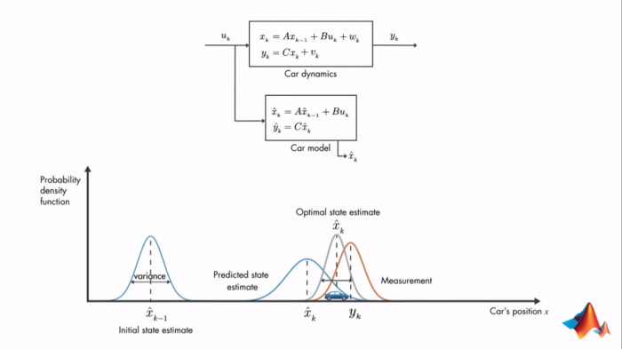

# Conceitos a serem discutidos

## Raciocínio probabilístico temporal

## Filtro de Kalman

O filtro de Kalman é um método para estimar variáveis ​​de estado não observáveis ​​a partir de variáveis ​​observáveis ​​que podem conter algum erro de medição.

É um algoritmo que requer dois tipos de equações: aquelas que relacionam as variáveis ​​de estado com as variáveis ​​observáveis (equações principais) e aquelas que determinam a estrutura temporal das variáveis ​​de estado (equações de estado ).

As estimativas das variáveis ​​de estado são feitas com base na dinâmica dessas variáveis ​​( dimensão de tempo ), bem como as medidas das variáveis ​​observáveis ​​que são obtidas a cada momento ( dimensão transversal ). Ou seja, a dinâmica é resumida em duas etapas:

1. Estime as variáveis ​​de estado usando sua própria dinâmica (estágio de previsão).

Melhorar essa primeira estimativa usando as informações das variáveis ​​observáveis (estágio de correção).

O filtro de Kalman tem inúmeras aplicações em tecnologia. Uma aplicação comum é a orientação, navegação e controle de veículos, especialmente naves espaciais, onde foi utilizada pela primeira vez na missão Apolo 11. Além disso, é amplamente utilizado em campos como processamento de sinais e econometria.

> JUNIOR, José, Filtro de Kalman, medium, 09 de junho de 2019. https://medium.com/@web2ajax/filtro-de-kalman-6e84f82993fc. Acesso em 11 de setembro de 2022.
